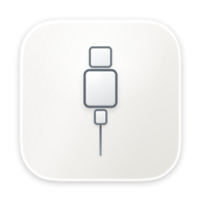

# USB Connection Sound

<p align="center">
  
</p>

[USB Connection Sound Support](https://brendanwang.github.io/USBSupportPage/)

A native macOS utility that plays original rising and falling chimes when USB devices connect and disconnect.

Open `USB Connection Sound.xcodeproj` in Xcode and run the USB Connection Sound scheme. The app targets macOS 14 Sonoma or later on Apple silicon and Intel Macs. Building the project requires Xcode 26.1 or later. Monitoring starts immediately, and closing the window keeps the app running in the menu bar. Use the menu bar menu to reopen the window or quit.

- Independent connection and disconnection chimes, with preview buttons.
- Saved mute and volume settings; preview buttons work even when alerts are muted.
- Click the menu bar icon for a quick sound toggle, volume slider, and both sound previews. These controls share the main window's saved settings.
- Connected USB devices and the latest connection event.
- Existing devices are discovered silently at startup.
- Device-level IOKit notifications avoid duplicate alerts for individual USB interfaces. Bursts in the same direction within 0.5 seconds share one chime, useful for hubs.
- App Sandbox stays enabled with the USB device entitlement. No driver installation is required.

The app must be running to play sounds. Audio uses the Mac's current output and respects system volume/mute. USB-C accessories must enumerate as USB devices; power-only cables, Bluetooth devices, and Thunderbolt-only devices do not produce USB events. macOS may also report device re-enumeration during sleep/wake as a connection change.

## Download

[Download USB Connection Sound 1.0.0](https://github.com/brendanwang/USBConnectionSound/releases/download/v1.0.0/USBConnectionSound-1.0.0.dmg) for macOS 14 or later (Apple silicon and Intel). Open the DMG and drag USB Connection Sound to Applications. The complete Xcode project is included in the Source folder.

This GitHub build is ad-hoc signed and is not notarized by Apple. macOS Gatekeeper may block its first launch.

## Energy use

Monitoring uses macOS notifications, with no polling, recurring timers, or persistent audio engine. Audio files stay loaded to keep alerts responsive. Zero volume skips audio playback entirely. Device lookup uses registry IDs, and a hub notification batch produces one sorted device-list update. Only the latest activity is retained. No App Nap override or process activity assertion is used.

For everyday use, use a Release build and keep only one copy running. In Xcode, choose Product > Scheme > Edit Scheme > Run > Build Configuration > Release, or build with `-configuration Release`. Closing the window leaves menu bar monitoring active. Idle CPU snapshots do not establish a battery percentage; actual energy use depends on the Mac and device activity.

## Validation

Build:

```sh
xcodebuild -project "USB Connection Sound.xcodeproj" -scheme "USB Connection Sound" -configuration Debug -derivedDataPath /tmp/USBConnectionSound-build CODE_SIGNING_ALLOWED=NO build
```

Monitor lifecycle smoke test (run from the repository root):

```sh
xcrun swiftc -parse-as-library "USB Connection Sound/USBMonitor.swift" Tests/MonitorSmoke.swift -o /tmp/usb-monitor-smoke
/tmp/usb-monitor-smoke
```

Hardware check: run the app, preview both sounds, attach a USB mouse or drive, and detach it. Verify the corresponding sound, device list, and latest activity. Repeat with a hub and while the main window is closed. Eject mounted storage before physically unplugging it.

Implementation follows Apple's IOKit matching notification API: https://developer.apple.com/documentation/iokit/1514362-ioserviceaddmatchingnotification
